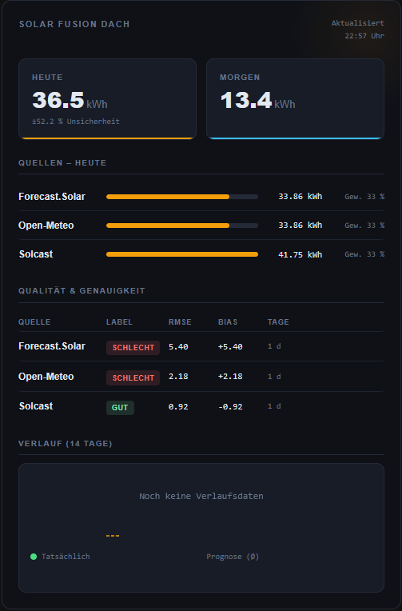

# Solar Fusion Card

[](https://github.com/hacs/integration)

Lovelace custom card for the [Solar Fusion](https://github.com/bw/hass-solar-fusion) integration.
Displays the fused PV forecast with source comparison, quality metrics, and a 14-day history sparkline.



## Features

- **Today & Tomorrow** – fused kWh value with uncertainty indicator
- **Source comparison** – bar chart and weighting for all active forecast sources
- **Quality table** – RMSE, bias, and quality label per source
- **History sparkline** – actual generation vs. forecast (14 days)
- Click any value to open the HA more-info dialog for the underlying entity

## Requirements

- Home Assistant with the [Solar Fusion](https://github.com/bw/hass-solar-fusion) integration installed
- HACS (for easy installation)

## Installation via HACS

1. HACS → Frontend → ⋮ → Custom repositories
2. Enter the repository URL, select category **Lovelace** → Add
3. Search for Solar Fusion Card in HACS and install it
4. Reload Home Assistant

## Manual installation

1. Copy `solar-fusion-card.js` to `/config/www/solar-fusion-card.js`
2. **Settings → Dashboards → Resources** → Add resource:
   - URL: `/local/solar-fusion-card.js`
   - Type: **JavaScript module**
3. Clear browser cache / hard reload

## Configuration

Only one entity is required – all other values are read automatically from its attributes.

```yaml
type: custom:solar-fusion-card
entity: sensor.solar_fusion_dach_fused_today
title: Solar Fusion Roof   # optional
```

### Options

| Option   | Type   | Default         | Description                        |
|----------|--------|-----------------|------------------------------------|
| `entity` | string | **required**    | `*_fused_today` sensor entity ID   |
| `title`  | string | `Solar Fusion`  | Card heading                       |

## License

MIT
