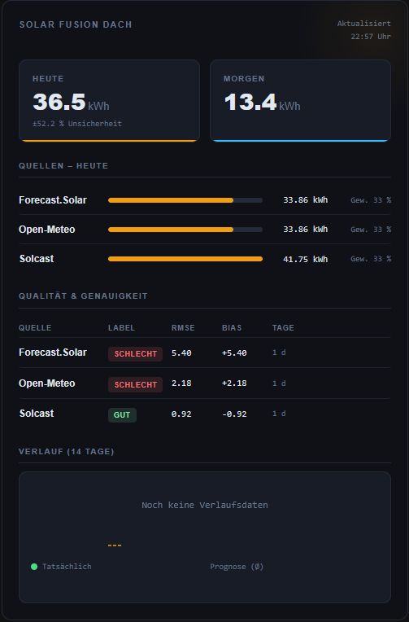

# Solar Fusion Card

[](https://github.com/hacs/integration) [](LICENSE) [](https://github.com/mkshb/hass-solar-fusion-card/actions/workflows/hacs-validate.yaml) [](https://github.com/mkshb/hass-solar-fusion-card/stargazers) [](https://github.com/mkshb/hass-solar-fusion/commits/main) [](https://github.com/mkshb/hass-solar-fusion-card/issues)


> [!IMPORTANT]
> **This repository is archived.** Since [Solar Fusion 0.4.0](https://github.com/mkshb/hass-solar-fusion/releases/tag/v0.4.0) the card ships with the integration – in a new Home Assistant style design – and is loaded automatically. No separate installation is needed.
>
> **Switching:** update Solar Fusion to 0.4.0 or newer, then
> 1. In HACS, uninstall **Solar Fusion Card**.
> 2. Under **Settings → Dashboards → ⋮ → Resources**, remove the `…/solar-fusion-card.js` resource if it is still listed.
> 3. Reload the browser.
>
> Your cards (`type: custom:solar-fusion-card`) keep working unchanged. Solar Fusion shows a repair issue as long as the old resource is registered. Issues and ideas for the card: [hass-solar-fusion](https://github.com/mkshb/hass-solar-fusion/issues).
>
> The documentation below describes the last standalone version (v0.1.15) for Solar Fusion up to 0.3.x.

Lovelace custom card for the [Solar Fusion](https://github.com/mkshb/hass-solar-fusion) integration.
Displays the fused PV forecast with source comparison, quality metrics, and a 14-day history sparkline.



## Features

- **Today & Tomorrow** – fused kWh value with uncertainty indicator
- **Source comparison** – bar chart and weighting for all active forecast sources
- **Quality table** – RMSE, bias, and quality label per source
- **History sparkline** – actual generation vs. forecast (14 days)
- Click any value to open the HA more-info dialog for the underlying entity

## Requirements

- Home Assistant with the [Solar Fusion](https://github.com/mkshb/hass-solar-fusion) integration installed
- HACS (for easy installation)

## Installation via HACS

1. HACS → Frontend → ⋮ → Custom repositories
2. Enter the repository URL, select category **Lovelace** → Add
3. Search for Solar Fusion Card in HACS and install it
4. Reload Home Assistant

## Manual installation

1. Create the folder `/config/www/hass-solar-fusion-card/`
2. Copy `solar-fusion-card.js` and the `locales/` folder into it:
   ```
   /config/www/hass-solar-fusion-card/solar-fusion-card.js
   /config/www/hass-solar-fusion-card/locales/en.json
   /config/www/hass-solar-fusion-card/locales/de.json
   ```
3. **Settings → Dashboards → Resources** → Add resource:
   - URL: `/local/hass-solar-fusion-card/solar-fusion-card.js`
   - Type: **JavaScript module**
4. Clear browser cache / hard reload

## Configuration

Only one entity is required – all other values are read automatically from its attributes.

```yaml
type: custom:solar-fusion-card
entity: sensor.solar_fusion_dach_fused_today
title: Solar Fusion Roof   # optional
```

### Options

| Option   | Type   | Default         | Description                        |
|----------|--------|-----------------|------------------------------------|
| `entity` | string | **required**    | `*_fused_today` sensor entity ID   |
| `title`  | string | `Solar Fusion`  | Card heading                       |

## Translations

The card ships with English (`en`) and German (`de`). All UI strings live in `dist/locales/<lang>.json`.

**Adding a new language is easy:**

1. Copy `dist/locales/en.json` to `dist/locales/<lang>.json` (e.g. `fr.json`, `nl.json`)
2. Translate the values – keep the keys unchanged
3. Open a pull request

The card automatically picks up the language set in your Home Assistant profile.

## License

MIT
